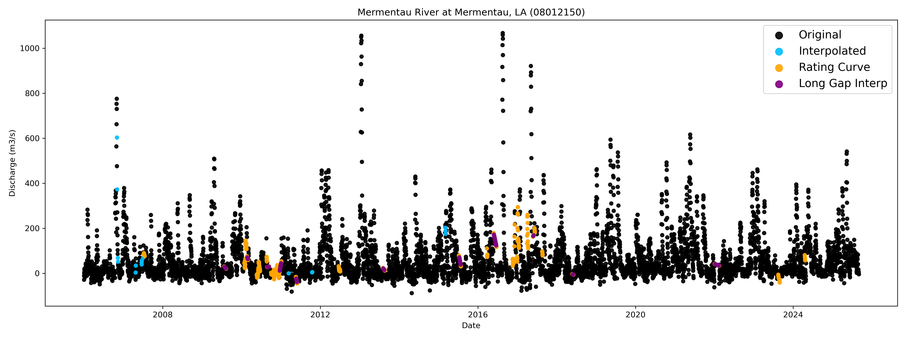
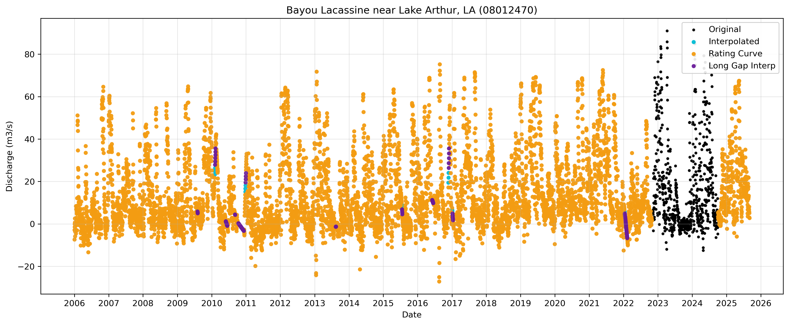

# Observed Tributary Flows (MP29 / 2029 Coastal Master Plan)

This folder contains gap-filled **daily tributary discharge time series** and associated **discharge plots** supporting development of boundary conditions for modeling efforts for the **2029 Coastal Master Plan (CMP)**.

## Contents

- [Folder contents](#folder-contents)
- [Code used to generate these outputs](#code-used-to-generate-these-outputs)
- [Outputs](#outputs)
  - [CSV time series](#csv-time-series)
  - [Fill-method definitions](#fill-method-definitions)
- [Rating curve evaluation results](#rating-curve-evaluation-results)
  - [Table 1: Rating curve fit (R²)](#table-1-rating-curve-fit-r²)
- [Figures](#figures)
- [Technical memorandum](#technical-memorandum)

## Folder contents

- `Plots_Discharge/` — discharge plots (PNG)
- `Data_Filled/` — gap-filled daily discharge time series outputs (CSV)

## Code used to generate these outputs

The observed tributary flow time series processing and plot generation are implemented in:

- [`process_tributary_flow_data.ipynb`](process_tributary_flow_data.ipynb)

Recommended usage is to run the notebook top-to-bottom in JupyterLab / Jupyter Notebook.

> Note: Additional notebooks/scripts will be added later for generating rating-curve figures and README will be updated.

## Outputs

### CSV time series

Processed daily discharge time series for each station are written to CSV files by automated Python scripting.

- Output directory: `Data_Filled/`

Each row of the CSV file contains a column that describes how the discharge value was processed in the column named `Discharge_filled_method`.

### Fill-method definitions

The discharge time series include a field describing the source/fill method:

- **Original**: Original discharge data from station
- **Interpolated**: Linear interpolation for short gaps (≤ 3 days)
- **Rating_curve_long_gap**: Estimated by a rating curve for long gaps (> 3 days)
- **Interpolated_long_gap**: Linear interpolation applied where a rating curve could not be applied for long gaps (> 3 days)
- **Unfillable**: Not fillable by short or long gap methods, usually at beginning or end of data time series

## Rating curve evaluation results

The rating curves were evaluated for the expanded time series (01/01/2006 to 09/01/2025), which incorporated data that had become available since the previous analysis.

### Table 1: Rating curve fit (R²)

**Table 1: Fit of tributary flow rating curves to observed data.** The coefficient of determination (R²) for the time period used to develop the original rating curves (01/01/2006 to 05/31/2014) and for the expanded time period incorporating additional data (01/01/2006 to 09/01/2025).

| Station ID | Station Name | R2 (Historical, 2006-2014) | R2 (Expanded, 2006-2025) |
|---:|---|---:|---:|
| 7381490 | Atchafalaya River at Simmesport, LA | 0.99 | 0.99 |
| 2470629 | Mobile River at River Mile 31 at Bucks, AL | 0.79 | 0.78 |
| 2471019 | Tensaw River near Mount Vernon, AL | 0.97 | 0.97 |
| 7381000 | Bayou Lafourche at Thibodeaux, LA | 0.24 | 0.06 |
| 7381235 | GIWW West of Bayou Lafourche at Larose, LA | 0.25 | 0.36 |
| 7385790 | Charenton Drainage Canal at Baldwin, LA | 0.16 | 0.14 |
| 7386980 | Vermilion River at Perry, LA | 0.13 | 0.08 |
| 8012150 | Mermentau River at Mermentau, LA | 0.71 | 0.69 |
| 8012470 | Bayou Lacassine near Lake Arthur, LA | (0.69*) | 0.45 |
| 8015500 | Calcasieu River near Kinder, LA | 0.68 | 0.56 |
| 8041780 | Neches River at Beaumont, TX | 0.83 | 0.83 |

\* The USGS station 08012470 was decommissioned in 2005. Data from 1987 to 2005 was used to generate a correlation to USGS station 08012150 (Attachment-C3-26_FINAL_03.08.2017.pdf, pp 4-5).

## Figures

### Figure 1 — Mermentau River at Mermentau, LA (USGS 08012150)

### Figure 2 — Bayou Lafourche (USGS 07381000)
*Figure 2: Stage to discharge rating curve at Bayou Lafourche (USGS 07381000) showing historical (blue) versus expanded/post‑historical (orange) observations with the rating curve (magenta).*

> TODO: Add the Figure 2 PNG to `Plots_Discharge/` and link it here.

### Figure 3 — Bayou Lacassine near Lake Arthur, LA (USGS 08012470)

*Figure 3 (caption): Bayou Lacassine near Lake Arthur, LA (USGS 08012470) gap-filled daily discharge time series showing original observations (black), short-gap interpolations (orange), rating-curve filled data (purple), and long-gap interpolations (teal).*

### Figure 4 — Mobile River at River Mile 31 (USGS 02470629)
*Figure 4: Stage to discharge rating curve at Mobile River at River Mile 31 (USGS 02470629) showing historical (blue) versus expanded/post‑historical (orange) observations with the rating curve (magenta).*

> TODO: Add the Figure 4 PNG to `Plots_Discharge/` and link it here.

---

## Technical memorandum 

### 2.0 Introduction

To support development of the 2029 Coastal Master Plan (CMP), tributary flow datasets that serve as boundary conditions for the 2029 CMP Integrated Compartment Model were updated by incorporating new data and generally following the methods developed for the 2017 CMP ([Attachment C3-26, Coastal Master Plan 2017 (PDF)](https://coastal.la.gov/wp-content/uploads/2017/04/Attachment-C3-26_FINAL_03.08.2017.pdf)).

#### Objectives

The first objective was to develop daily averaged discharge time series for tributaries in coastal Louisiana (for tributary locations see Figure 1 and Table 1 in [Attachment-C3-26_FINAL_03.08.2017.pdf](https://coastal.la.gov/wp-content/uploads/2017/04/Attachment-C3-26_FINAL_03.08.2017.pdf)). A secondary objective was to develop Python scripts for reproducibility, ease, transparency, and functionality for processing.

### 3.0 Data and Methods

#### Data Retrieval and Processing

Tributary data were downloaded from the United States Geological Survey’s (USGS) National Water Information System (NWIS) ([https://waterdata.usgs.gov/nwis](https://waterdata.usgs.gov/nwis)) ([https://waterdata.usgs.gov/](https://waterdata.usgs) for the time period 01/01/2006 to 09/01/2025. USGS data were retrieved from NWIS using the data retrieval Python package (dataretrieval.nwis.get_dv). Tributary data from the United States Army Corps of Engineers ([https://rivergages.mvr.usace.army.mil/WaterControl/stationinfo2.cfm?sid=01100Q](https://rivergages.mvr.usace.army.mil/WaterControl/stationinfo2.cfm?sid=01100Q)) for the time period 01/01/2006 to 09/01/2025 were downloaded locally since automating download was not possible without Representational State Transfer Application Programming Interfaces (REST APIs).

Data processing and analysis was implemented using code developed in Python as a reproducible workflow. The Python code used to generate these outputs is available in this repository and folder: [`files/observed_tributary_flows/process_tributary_flow_data.ipynb`](process_tributary_flow_data.ipynb).

The original downloaded data were converted to metric units and reindexed to a daily timestep. USGS daily mean values of discharge and stage were used as the primary data sources. When daily mean values were not available, instantaneous discharge and stage values were downloaded and averaged to daily values. The known sentinel value of XXX was set to NaN, as were values for days without data. A data gap analysis was performed on the daily discharge time series from each tributary station to identify the timing and duration of missing data. The following rules were applied to address data gaps (similar to the methods in the 2017 Coastal Master Plan, Attachment C3‑26: [Attachment-C3-26_FINAL_03.08.2017.pdf](https://coastal.la.gov/wp-content/uploads/2017/04/Attachment-C3-26_FINAL_03.08.2017.pdf)):

• Data gaps with duration less than or equal to 3 days were filled by linear interpolation  
• Data gaps with duration greater than 3 days were filled using a rating curve  

Short data gaps with a duration less than or equal to 3 days were filled first with linear interpolation. Rating curves developed for the 2017 CMP were used as the initial equations to fill data gaps with a duration greater than 3 days (Section 2.2.2 in [Attachment-C3-26_FINAL_03.08.2017.pdf](https://coastal.la.gov/wp-content/uploads/2017/04/Attachment-C3-26_FINAL_03.08.2017.pdf)). These rating curves identified both stage to discharge (Q to H) and discharge to discharge (Q to Q) rating curves for stations with missing data for a target (dependent station) from an independent station. For some stations, there were also data gaps in the independent data used for the rating curves. In these instances, these gaps were filled using linear interpolation. Any additional missing data, for example at the start or end of a discharge time series was flagged as unfillable.

#### Outputs

Processed daily discharge time series for each station were written to CSV files by automated Python scripting. Each row of the CSV file contains a column that describes how the discharge value was processed in the column named “Discharge_filled_method.” The fill methods are:

• Original: Original discharge data from station  
• Interpolated: Linear interpolation for short gaps (≤ 3 days).  
• Rating_curve_long_gap: Estimated by a rating curve for long gaps (> 3 days)  
• Interpolated_long_gap: Linear interpolation applied where a rating curve could not be applied for long gap (> 3 days)  
• Unfillable: Not fillable by short or long gap methods, usually at beginning or end of data time series  

The code also automates saving PNG plots of the processed daily discharge time series for each station. Each processing fill methods is shown in a distinct color so original and fill methods are distinguishable (Figure 1).

### Evaluation and Updating of Rating Curves

The rating curves were evaluated for an expanded time series (01/01/2006 to 09/01/2025), which incorporated data that had become available after the original analysis period (01/01/2006 to 5/31/2014). The analysis compared the fit of the rating curves measured between the expanded time series data and the original time series ([Attachment-C3-26_FINAL_03.08.2017.pdf](https://coastal.la.gov/wp-content/uploads/2017/04/Attachment-C3-26_FINAL). For both time periods, statistical metrics were computed using only samples where original (not gap filled) observations were available at both the target station and analog stations. The 2017 analysis (Attachment-C3-26_FINAL_03.08.2017.pdf) appears to have used gap filled values for the computed statistical metrics. Therefore, metrics from the initial 2017 analysis are not directly comparable since the methodology used differs. The fit was assessed both using visual inspection and using the coefficient of determination (R2), root mean square error, bias, and Nash-Sutcliffe efficiency.

Stations where the fit of the rating curve equation had a change based on visual inspection or decreased substantially for the expanded time series compared to the original time period over which the rating curves were developed, were further analyzed. For these stations, the rating curves were updated based on knowledge of environmental factors (e.g., floodplain connectivity) and project changes (e.g., construction). As appropriate to fit the data at a given location/station, updates included revising the existing rating curve and developing two separate rating curves for a target station to represent different characteristics.

### 4.0 Results

Daily tributary discharge time series were processed for 34 stations (Figure 1, Table 1, and Appendix A).

#### Rating Curve Evaluation

For the 12 stations with rating curves, stations that continued to have a good fit with the original rating curve, such as at Mermenatau River at Perry (Figure 1), were not changed and the same rating curve was applied to the expanded time series.

For Bayou Lafourche (USGS 07381000), the fit of the rating curve to the data decreased to an R2 of 0.06 (Table 1) for the expanded time series. The stage (H) and discharge (Q) relationship showed two distinct patterns. The change in the relationship is assumed to be caused by dredging in Bayou Lafourche that occurred in 2016 for the Mississippi Reintroduction into Bayou Lafourche project, which removed almost 800,000 cubic yards of sediment between Belle Rose and Napoleonville ([A45627AB-88F0-48BD-8969-868E28FDC540.Pump-Station-Groundbreaking-Handouts-revised-10.20.22-2.pdf](https://coastal.la.gov/wp-content/uploads/2022/10/A45627AB-88F0-48BD-8969-868E28FDC540.Pump-Station-Groundbreaking-Handouts-revised-10.20.22-2.pdf)). Therefore, two rating curves were developed, with one fit prior to 2016 and the other after 2016 (Figure 2).

The Bayou Lacassine (USGS 08012470) gage had limited data to develop the historical rating curve because the station was decommissioned in 2005. Data from 1987-2005 were used to develop a rating curve ([Attachment-C3-26_FINAL_03.08.2017.pdf](https://coastal.la.gov/wp-content/uploads/2017/04/Attachment-C3-26_FINAL_03.08.2017.pdf)). In the expanded time series, limited data were available at the target and analog stations. These concurrent data were used to develop an updated rating curve (Figure 3). The revised rating curve produced time series that were reflective of the period of record.

Mobile River at River Mile 31 (USGS 2470629) shows a shift in the H to Q relationship at H > 2.5 m (Figure 4). In the historical analysis, the correlation between Q and H was truncated at H > 2.5 m, and gaps above this threshold were filled with linear interpolation versus the rating curve ([Attachment-C3-26_FINAL_03.08.2017.pdf](https://coastal.la.gov/wp-content/uploads/2017/04/Attachment-C3-26_FINAL_03.08.2017.pdf)). For this analysis, it was determined that since the gate is tidally influenced, and that both extreme surge/tidal levels and flood plain/surface connectivity at this location exist, this justified a secondary rating curve for H > 2.5 m (Figure 4).

### Figure 2

Figure 2: Stage to discharge rating curve at Bayou Lafourche (USGS 07381000) showing historical (blue) versus expanded/post‑historical (orange) observations with the rating curve (magenta).

### Figure 3

Figure 3: Bayou Lacassine near Lake Arthur, LA (USGS 08012470) gap-filled daily discharge time series showing original observations (black), short-gap interpolations (orange), rating-curve filled data (purple), and long-gap interpolations (teal).

### Figure 4

Figure 4: Stage to discharge rating curve at Mobile River at River Mile 31 (USGS 02470629) showing historical (blue) versus expanded/post‑historical (orange) observations with the rating curve (magenta).

### FILLED TIME SERIES

Gap-filled daily discharge time series were saved to CSV files and as figures. Each dataset includes whether the data is from the original source, or the method used for filling (e.g., interpolation, rating curve). The gap-filled tributary discharge time series are used as input datasets to the 2029 Coastal Master Plan Integrated Compartment Model.

## Citation

Coastal Protection and Restoration Authority (CPRA). (2025). *2029 Coastal Master Plan: Scenarios for Project Selection*. Version I. Baton Rouge, Louisiana: Coastal Protection and Restoration Authority.

Coastal Protection and Restoration Authority (CPRA). (2017, March 8). *Coastal Master Plan 2017: Attachment C3-26* [PDF]. Coastal Protection and Restoration Authority. Retrieved December 2025. From https://coastal.la.gov/wp-content/uploads/2017/04/Attachment-C3-26_FINAL_03.08.2017.pdf

Coastal Protection and Restoration Authority (CPRA). (2022, October 20). *Pump Station Groundbreaking Handouts (revised 10.20.22-2)* [PDF]. Coastal Protection and Restoration Authority. Retrieved December 2025. From https://coastal.la.gov/wp-content/uploads/2022/10/A45627AB-88F0-48BD-8969-868E28FDC540.Pump-Station-Groundbreaking-Handouts-revised-10.20.22-2.pdf

U.S. Geological Survey (USGS). (n.d.). *National Water Information System (NWIS)*. USGS Water Data for the Nation. Retrieved December 2025. From https://waterdata.usgs.gov/nwis

U.S. Geological Survey (USGS). (n.d.). *USGS Water Data for the Nation*. U.S. Geological Survey. Retrieved December 2025. From https://waterdata.usgs.gov/

U.S. Army Corps of Engineers (USACE), Mississippi Valley Division. (n.d.). *RiverGages: Station Information (sid=01100Q)*. U.S. Army Corps of Engineers. Retrieved December 2025. From https://rivergages.mvr.usace.army.mil/Water

### Acknowledgments

This document was developed in support of the 2029 Coastal Master Plan under the guidance of the Master Plan Delivery Team (MPDT):

• Coastal Protection and Restoration Authority (CPRA) – Ashley Cobb, Jessica Converse, Katie Freer, Elizabeth Jarrell, Valencia Henderson, Sam Martin and Eric White  
• University of New Orleans – Denise Reed
### Rating Curve Evaluation

